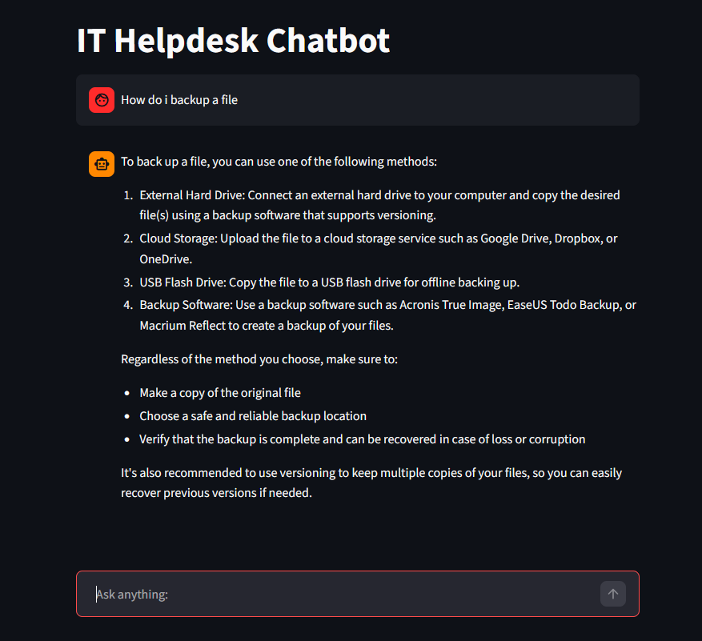
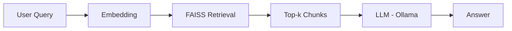

# IT Helpdesk with RAG

## Demo


---

## Overview
This project implements a **Retrieval-Augmented Generation (RAG)** system for answering IT helpdesk questions. The system retrieves relevant knowledge base articles and uses a local large language model to generate context-aware responses. This system uses FAISS for vector search, Sentence Transformers for embeddings, and a locally hosted LLaMA 3.2 model via Ollama for answer generation.

### Dataset
This project uses the Synthetic IT Helpdesk Knowledge Base dataset from Kaggle:

https://www.kaggle.com/datasets/dkhundley/synthetic-it-related-knowledge-items

The dataset contains IT support knowledge articles in CSV format, with fields such as:
- `ki_topic`: the topic of the issue  
- `ki_text`: the main knowledge base content  
- `alt_ki_text`: alternative phrasing of the same content  
- `bad_ki_text`: poorly written or noisy versions of the content

This dataset simulates real-world IT helpdesk scenarios and enables testing of retrieval and question-answering performance.

### Purpose
- Build an end-to-end RAG system from scratch  
- Demonstrate understanding of embeddings, retrieval, and LLM integration  
- Provide a practical chatbot for IT support scenarios  

---

## Features
- RAG-based question answering
- Local LLM inference via Ollama
- Semantic search using FAISS
- Streamlit chatbot UI

---
## Tech Stack

- **Language:** Python  
- **LLM:** LLaMA 3.2:3b(via Ollama)  
- **Embeddings:** Sentence Transformers (`Qwen3-Embedding-0.6B`)  
- **Vector Database:** FAISS  
- **Frontend/UI:** Streamlit  
- 
### Architecture


---

## Evaluation
- Evaluated using 15 set of manually created test queries  
- Keyword-based scoring for:
  - Retrieval quality  
  - Answer relevance  

### Metrics
- Retrieval Score (keyword match in retrieved chunks)  
- Answer Score (keyword match in generated response)  

### Results
- Average Retrieval Score: 0.87
- Average Answer Score: 0.85

### Performance
- Average retrieval time: 3.42 s  
- Average generation time: 7.58 s   

---

## How to Run
```bash
pip install -r requirements.txt
ollama run llama3.2:3b
streamlit run app.py
```
---

## Future improvements
- Improve embedding model for better retrieval accuracy
- Enhance chunking strategy
- Add conversation memory
- Implement better evaluation metrics
- Deploy as a web application